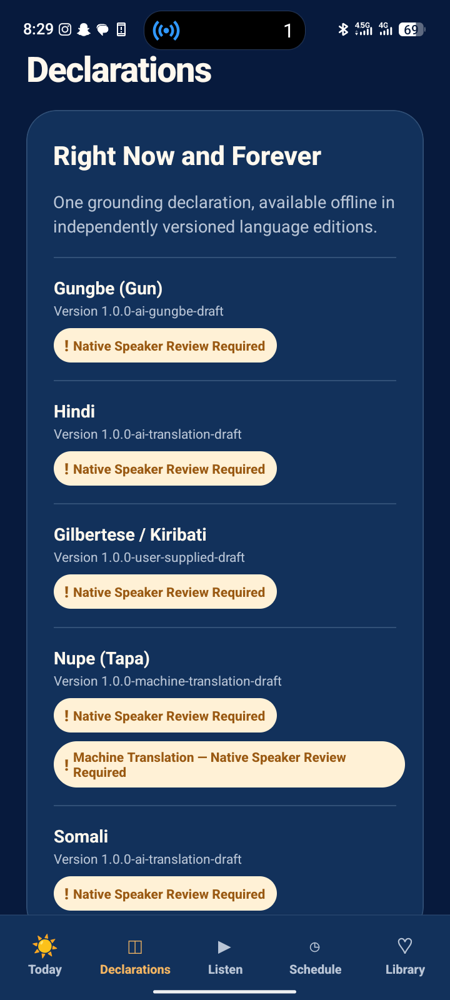

# Forever Affirmed

**Speak good into every day.**

Forever Affirmed is a privacy-first, offline-capable Expo/React Native
application for reading and scheduling multilingual declarations.

## App Preview

<p align="center">
  
</p>

## Key Features

- Expo Router navigation across Today, Declarations, Listen, Schedule,
  Library and Settings.
- Versioned declaration content validated with Zod outside the UI layer.
- SQLite persistence for migrations, favourites, schedules and session history.
- Zustand state management with local persistence.
- IANA-timezone scheduling for device, declaration and manual timezone modes.
- Optional local notifications; reminders never autoplay audio.
- Provider-independent speech and audio interfaces with
  verification-aware fallback behaviour.
- Accessible light and dark design system.
- Automated tests covering UTC+13/UTC+14, DST, validation, persistence,
  notifications, audio fallback and playback state.

## Technology

- React Native
- Expo
- TypeScript
- Expo Router
- SQLite
- Zustand
- Zod
- Jest

## Development Approach

This project was developed using an AI-assisted engineering workflow
with VS Code and OpenAI Codex.

I directed development through detailed requirements and iterative
implementation instructions, reviewed and tested changes, debugged
issues, made direct code modifications where required, and refined
the application across multiple development sessions.

## Run Locally

Requirements:

- Node.js 22.13 or newer
- npm
- Android Studio/SDK for native Android builds

```bash
npm install
npm run dev
npm run check
